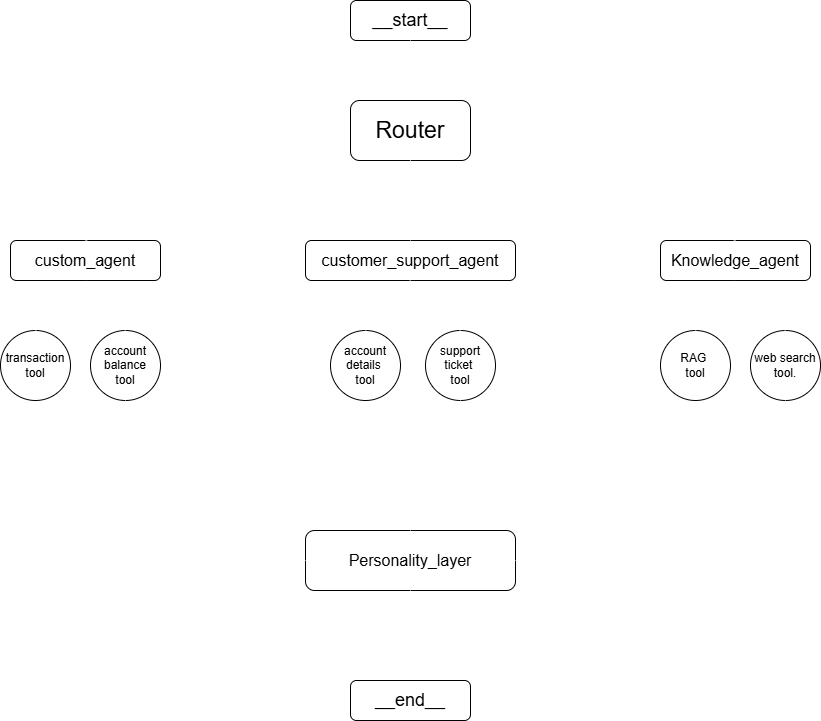

# Agent Swarm

## Table of Contents
1. [Introduction](#introduction)
2. [Agent Swarm Architecture](#agent-swarm-architecture)
3. [Agents](#agents)
   1. [Router Agent](#1-router-agent)
   2. [Knowledge Agent](#2-knowledge-agent)
      - [Knowledge Agent Explanation](#21-knowledge-agent-explanation) 
      - [RAG Pipeline Explanation](#22-rag-pipeline-explanation) 
   3. [Customer Support Agent](#3-customer-support-agent)
   4. [General Agent](#4-general-agent)
   5. [Personality Layer](#5-personality-layer)
4. [How to Run](#how-to-run)
5. [API Endpoints](#api-endpoints)
6. [Testing](#testing)
7. [Dockerization](#dockerization)
8. [Conclusion](#conclusion)

---

## Introduction
Welcome to **Agent Swarm** – a powerful multi-agent system built to intelligently route and respond to diverse user queries. This architecture features specialized agents tailored for handling InfinitePay product-related inquiries, customer support issues, and general queries such as account balances and transaction details.

Additionally, the system integrates useful tools like a Slack notification utility to flag and report suspicious activity in real time.

---

## Agent Swarm Architecture
The architecture of the Agent Swarm consists of the following main agents and components:

- **Router Agent**: Decides which specialized agent will handle a user's query.
- **Knowledge Agent**: Handles queries related to InfinitePay products and services.
- **Customer Support Agent**: Handles queries related to customer support.
- **custom Agent**: Handles general-purpose queries and uses tools for specific needs like news and suspicious activities.
- **slack agent**: Sends message if any suspecious activity found in chat.
- **Personality Layer**: Enhances the response to be more user-friendly and empathetic.



---

## Agents

### 1. **Router Agent**
- **Role**: Decides which agent (KnowledgeAgent, CustomerSupportAgent,slackAgent or CustomAgent) should handle the incoming query based on its content.
- **Responsibilities**:
  - Routes the query to the appropriate agent.
  - Manages the workflow and data flow between agents.

### 2. **Knowledge Agent**

#### 2.1 Knowledge Agent Explanation

- **Role**: Answers questions based on publicly available content from the InfinitePay website (https://www.infinitepay.io/) or general search results.
- **Features**:
  - Uses a **Retrieval Augmented Generation (RAG)** pipeline to fetch data from the InfinitePay website.
  - If no data is found in the knowledge base, uses the **DuckDuckGo search tool**.

#### 2.2 **RAG Pipeline Explanation**

The Knowledge Agent leverages a Retrieval-Augmented Generation (RAG) pipeline to efficiently answer user queries. It first retrieves relevant context from a structured knowledge base and then generates accurate responses grounded in that information. This approach ensures fact-based answers by drawing content from InfinitePay's website and trusted external sources.

#### **How the RAG Pipeline Works**:
1. **Scraping Content**: The agent scrapes content from the specified InfinitePay website pages, extracting relevant sections such as headings, paragraphs, and lists.
2. **Text Chunking**: The scraped content is divided into smaller chunks of 500 words. This allows the information to be processed more efficiently and indexed for faster search results.
3. **Vectorization**: The text chunks are converted into vectors using a **HuggingFace** embeddings model (`paraphrase-multilingual-MiniLM-L12-v2`), which is used for similarity search. These vectors are stored in a **FAISS** vector database for quick retrieval.
4. **Similarity Search**: When a user submits a query, the system performs a similarity search on the vector database. It retrieves the top 3 matching documents based on their relevance to the query.
5. **Response Generation**: If relevant documents are found, they are passed to the **gemini-1.5-flash model** for response generation. If no relevant data is found in the knowledge base, the agent will use the **DuckDuckGo** search tool to search the web for relevant answers.
6. **Fallback**: If the similarity search fails to find relevant data, the system defaults to using the DuckDuckGo search tool to provide the most relevant information from external sources.

This process ensures that the **Knowledge Agent** provides accurate and contextually relevant responses to user queries, backed by the most up-to-date information from InfinitePay's website and the web.
  
#### Tools:
- **Web search using DuckDuckGo** for external general queries.

### 3. **Customer Support Agent**
- **Role**: Handles customer queries related to customer user information and support requests.
- **Features**:
  - Uses internal **Database Tool** to retrieve user data and respond.
  - Uses **Email Tool** to notify the support team if necessary (Redirect mechanism to human).

#### Tools:
- **Database Tool** to access user data.
- **Email Tool** to notify the support team.

### 4. **Custom Agent**
- **Role**: Handles general-purpose queries, like account's transactions and balaces etc.

### 5. **slack tool**:
- **Slack Notification Tool** for suspicious queries.
- **News Tool** to fetch articles based on a city or topic.

### 6. **Personality Layer**
- **Role**: Rewrites responses in a more natural, friendly, and empathetic tone to enhance user experience.
  
---

## How to Run

1. **Clone the repository**:
    ```bash
    git clone https://github.com/thummar05/Agent-Swarm.git
    cd Agent-Swarm
    ```

2. **Install dependencies**:
    - Create a virtual environment:
      ```bash
      python3 -m venv myenv
      ```
    - Activate the virtual environment:
      ```bash
      # On Windows
      myenv\Scripts\activate
      # On Linux/macOS
      source myenv/bin/activate
      ```
    - Install the required dependencies:
      ```bash
      pip install -r requirements.txt
      ```
3. **Create .env file**:
   Add variables in it.
   ```
   API_ENDPOINT
   API_KEY
   SLACK_WEBHOOK_URL
   SUPPORT_EMAIL  
   SMTP_SERVER 
   SMTP_PORT 
   SENDER_EMAIL 
   SENDER_PASSWORD
   ```
4. **Run the FastAPI application**:
    ```bash
    python main.py
    ```

5. **Access the application**:
    The app will be running on `http://localhost:8000`.

---

## API Endpoints

### POST `/process_query`
- **Description**: Handles user queries by passing them to the appropriate agent for processing.
- **Request body**:
    ```json
    {
    "user_id":"client789",
    "message":"What are the rates for debit and credit card transactions?"
   }
    ```
- **Response**:
    ```json
    {
    "response": "Here are the transaction rates for card and payment link sales:\n\n- Credit card (one-time payment): 5.49%\n- Installments up to 6 times: 13.99%\n- Installments up to 12 times: 18.29%\n\nFor Pix transactions, there is no fee, so you can receive instant payments at 0.00%.",
    "source_agent_response": "As taxas para vendas no cartão e no Link de Pagamento são as seguintes:\n\n- Crédito à vista: 5,49%\n- Parcelado em 6x: 13,99%\n- Parcelado em 12x: 18,29%\n\nPara o serviço Pix, a taxa é zero, permitindo receber na hora por 0,00%.",
    "agent_workflow": [
        {
            "agent_name": "RouterAgent",
            "tool_calls": {
                "LLM": "KnowledgeAgent"
            }
        },
        [
            {
                "agent_name": "KnowledgeAgent",
                "tool_calls": {
                    "RAG": "As taxas para vendas no cartão e no Link de Pagamento são as seguintes:\n\n- Crédito à vista: 5,49%\n- Parcelado em 6x: 13,99%\n- Parcelado em 12x: 18,29%\n\nPara o serviço Pix, a taxa é zero, permitindo receber na hora por 0,00%."
                }
            }
        ],
        {
            "agent_name": "PersonalityLayer",
            "tool_calls": {
                "LLM": "Here are the transaction rates for card and payment link sales:\n\n- Credit card (one-time payment): 5.49%\n- Installments up to 6 times: 13.99%\n- Installments up to 12 times: 18.29%\n\nFor Pix transactions, there is no fee, so you can receive instant payments at 0.00%."
            }
        }
    ]
}
    ```

---

## Testing
#### Here are some [Test cases](test-cases.md)

1. **Unit Tests**: Ensure the correct functioning of individual agents (KnowledgeAgent, CustomerSupportAgent, GeneralAgent).
2. **Integration Tests**: Test the interaction between agents (e.g., RouterAgent routing to the correct agent).
3. **API Tests**: Use tools like **Postman** or **Insomnia** to test the `/process_query` endpoint.

---

## Dockerization

### Dockerfile
A **Dockerfile** is provided to containerize the application. You can build and run the container with the following commands:

1. **Build the Docker image**:
    ```bash
    docker build -t agent-swarm-app .
    ```

2. **Run the Docker container**:
    ```bash
    docker run -p 8000:8000 agent-swarm-app
    ```

3. **Access the application**:
    The app will be available at `http://localhost:8000`.

---


