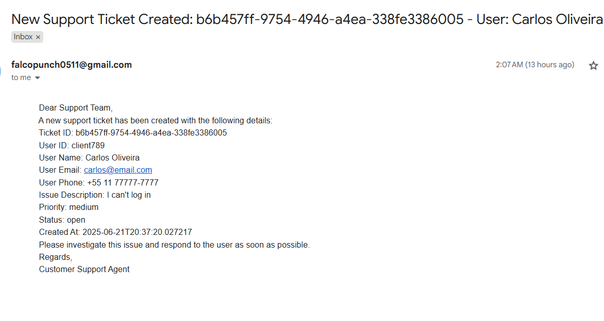

# Agent Swarm Test Cases

This document describes the test cases for both unit tests and the complete workflow of the **Agent Swarm** system. It ensures the correctness of individual agents and their interactions within the system.

## Table of Contents

1. [Unit Tests](#unit-tests)
   1. [Customer Support Agent Tests](#customer-support-agent-tests)
   2. [Custom Agent Test Cases](#custom-agent-test-cases)
   3. [Knowledge Agent Test Cases](#knowledge-agent-test-cases)
2. [End-to-End Tests](#end-to-end-tests)

---

## Unit Tests

### Customer Support Agent Tests

#### 1. **create_support_ticket Tool**

- **Test Case**: Handle query for account login,transactions,etc issues.
- **Input**:
    ```json
    {
        "message": "I'm not able to login into my account",
        "user_id": "client789"
    }
    ```
- **Response**:
    ```json
    {
        "tool_name": "create_support_ticket",
        "Response": "Our support team will contact you soon regarding your question: “I'm not able to login my account.” (user: client788)."
    }
    ```
- **Email Received**:
  

#### 2. **Database Tool**

- **Test Case**: Handle query for user's account's information.
- **Input**:
    ```json
    {
        "message": "I want to check my account status",
        "user_id": "client789"
    }
    ```
- **Response**:
    ```json
    {
      "tool_calls": {
        "get_user_info": "{\"success\": true, \"data\": {\"name\": \"Carlos Oliveira\", \"email\": \"carlos@email.com\", \"account_status\": \"active\", \"created_date\": \"2023-03-25\"}, \"message\": \"User information retrieved successfully\"}"
      }
    },
    ```

### Custom-Agent Test Cases

#### 1. **Fetch account balance**

- **Test Case**: Handle the query of user's account balance
- **Input**:
    ```json
    {
        "message": "what is my current account balance?",
        "user_id": "client789",
    }
    ```
- **Response**:
    ```json
    {
        "tool_calls": {
        "get_account_balance": "{\"success\": true, \"data\": {\"balance\": 500.75}, \"message\": \"Account balance retrieved successfully\"}"
      }
    }
    ```

#### 2. **Fetch account's recent transactions**

- **Test Case**: user's last five transactions
- **Input**:
    ```json
    {
        "message": "what were my last five transactions?",
        "user_id": "client789",
    }
    ```
- **Response**:
    ```json
    {
        "tool_calls": {
        "get_recent_transactions": "{\"success\": true, \"data\": {\"transactions\": [{\"id\": \"tx005\", \"amount\": -300.0, \"date\": \"2025-06-12\", \"description\": \"Pagamento boleto\"}, {\"id\": \"tx006\", \"amount\": 400.0, \"date\": \"2025-06-11\", \"description\": \"Depósito via transferência\"}, {\"id\": \"tx007\", \"amount\": -50.0, \"date\": \"2025-06-10\", \"description\": \"Compra online\"}]}, \"message\": \"Retrieved 3 recent transactions\"}"}
    }
    ```

### Knowledge Agent Test Cases

#### 1. **RAG**

- **Test Case**: Use Retrieval-Augmented Generation to fetch details about Maquininha Smart.
- **Input**:
    ```json
    {
        "message": "What are the fees of the Maquininha Smart?",
        "user_id": "client790",
        
    }
    ```
- **Response**:
    ```json
    {
        "tool_name": "RAG",
        "Response": "The fees for the Maquininha Smart are as follows:\n\n- 0.00% for Pix\n- 0.75% for Debit\n- 2.69% for Credit 1x\n- 8.99% for Credit 12x"
    }
    ```

#### 2. **DuckDuckGo Search Tool**

- **Test Case**: Use DuckDuckGo search tool for general query.
- **Input**:
    ```json
    {
        "message": "Tell me about recent fintech innovations in Latin America.",
        "user_id": "client789",
    }
    ```
- **Response**:
    ```json
    {
        "tool_calls": {
        "web_search": "Premium Statistic Fintech revenue in Latin America 2017-2023, with forecasts to 2028 Premium Statistic Population using mobile money services in Latin America 2021, by select countries Insights from industry experts and recent data suggest that the region's fintech ecosystem is not only bouncing back but also evolving in ways that could reshape financial services across Latin America. A Steady Climb in Fintech Investments. The Latin American fintech sector has witnessed fluctuating investment trends over recent years. In ... The fintech sector in Latin America continues to evolve, adopting emerging technologies and expanding its reach beyond traditional financial transactions. Artificial intelligence (AI) is at the center of these innovations, with 83 fintechs in the region already utilizing this technology, according to the Emerging Tech Report 2024. As Latin America becomes a global leader in fintech innovation, open APIs are transforming how financial services are delivered, enabling faster product development, seamless integration, and enhanced user experiences.With fintech investments in Latin America surpassing $8 billion in 2022 (CB Insights) and initiatives like Brazil's Open Finance system and Mexico's Fintech Law gaining ... Latin America (LATAM) has witnessed a significant shift towards digital payments, with its FinTech industry experiencing remarkable growth and even doubling in size between 2018 and 2021. LATAM's increasing adoption of payment technology is driven largely by the desire to bridge the financial inclusion gap, improve efficiency, and foster ..."}
      }
    ```

---

## End-to-End Tests

### 1. **End-to-End Query Flow**

- **Test Case**: Test the complete flow from RouterAgent to KnowledgeAgent and PersonalityLayer.
- **Input**:
    ```json
    {
        "message": "Como posso usar meu telefone como uma máquina de cartão?",
        "user_id": "client789",
    }
    ```
- **Response**:
    ```json
    {
        "response": "Olá!  Que ótimo que você quer usar seu celular para receber pagamentos!  Com o aplicativo InfinityPay e o recurso InfiniteTap, você pode fazer exatamente isso!  Basta baixar o aplicativo e aproveitar a praticidade de receber pagamentos por aproximação, diretamente no seu telefone.  \n\nFicou com alguma dúvida ou precisa de ajuda com o download ou configuração?  Estou à disposição!",
        "source_agent_response": "Para usar seu telefone como uma máquina de cartão, baixe o aplicativo InfinitePay e utilize a função InfiniteTap.  Este aplicativo permite que você receba pagamentos por aproximação, transformando seu celular em uma maquininha de cartão.",
        "agent_workflow": [
            {
            "agent_name": "RouterAgent",
            "tool_calls": {
                "LLM_decision": "KnowledgeAgent"
            }
            },
            {
            "agent_name": "KnowledgeAgent",
            "tool_calls": {
                "retrieve_knowledge": "Para usar seu telefone como uma máquina de cartão, você pode baixar o aplicativo InfinitePay e usar a função InfiniteTap.  O aplicativo transforma seu dispositivo em uma máquina de cartão para que você possa receber pagamentos por aproximação."
            }
            },
            {
            "agent_name": "PersonalityLayer",
            "tool_calls": {
                "LLM": "Olá!  Que ótimo que você quer usar seu celular para receber pagamentos!  Com o aplicativo InfinityPay e o recurso InfiniteTap, você pode fazer exatamente isso!  Basta baixar o aplicativo e aproveitar a praticidade de receber pagamentos por aproximação, diretamente no seu telefone.  \n\nFicou com alguma dúvida ou precisa de ajuda com o download ou configuração?  Estou à disposição!"
            }
            }
        ]
    }
    ```

### 2. **End-to-End Error Handling Flow**

- **Test Case**: Test the full flow with error handling, such as a user query for making payments.
- **Input**:
    ```json
    {
        "message": "I'm not able to make payments?",
        "user_id": "client789",
    }
    ```
- **Response**:
    ```json
    {
    "response": "I'm so sorry you're having trouble making payments!  I've already created a support ticket (ID: 34b28942-ee49-4818-ad75-3392e5f201a7) for you, and you'll receive an email with updates shortly.  Is there anything else I can assist you with today?",
    "source_agent_response": "Oh no, I'm sorry to hear you're having trouble making payments. I've created a support ticket (ID: 34b28942-ee49-4818-ad75-3392e5f201a7) to get this resolved for you quickly.  You'll receive an email with updates.  In the meantime, is there anything else I can help you with?",
    "agent_workflow": [
        {
        "agent_name": "RouterAgent",
        "tool_calls": {
            "LLM_decision": "CustomerSupportAgent"
        }
        },
        {
        "agent_name": "CustomerSupportAgent",
        "tool_calls": {
            "create_support_ticket": "{\"success\": true, \"data\": {\"ticket_id\": \"34b28942-ee49-4818-ad75-3392e5f201a7\"}, \"message\": \"Support ticket 34b28942-ee49-4818-ad75-3392e5f201a7 created successfully. Email notification sent.\"}"
        }
        },
        {
        "agent_name": "PersonalityLayer",
        "tool_calls": {
            "LLM": "I'm so sorry you're having trouble making payments!  I've already created a support ticket (ID: 34b28942-ee49-4818-ad75-3392e5f201a7) for you, and you'll receive an email with updates shortly.  Is there anything else I can assist you with today?"
        }
        }
    ]
    }
    ```

---

